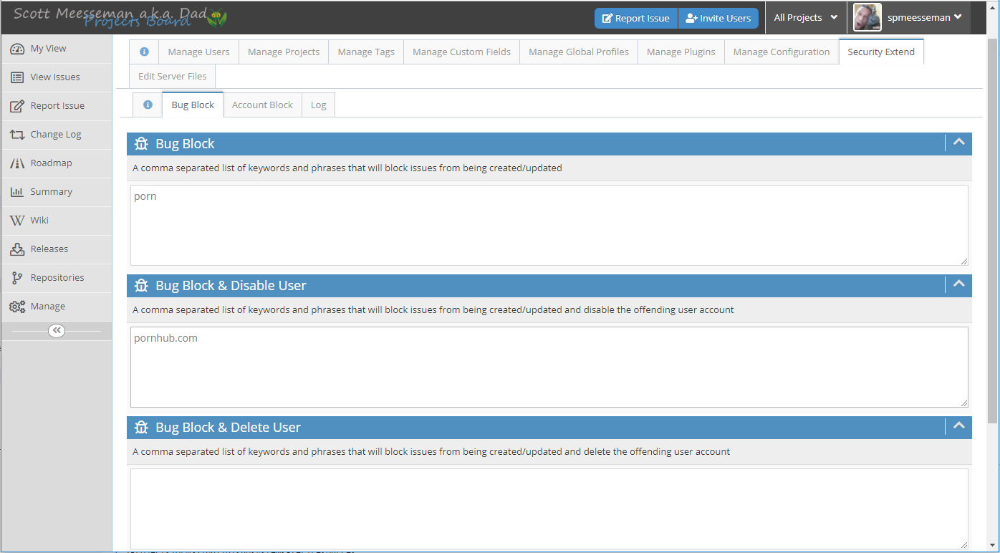
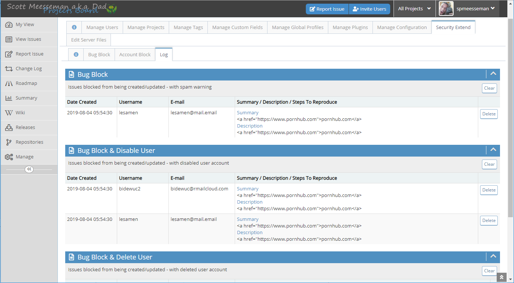
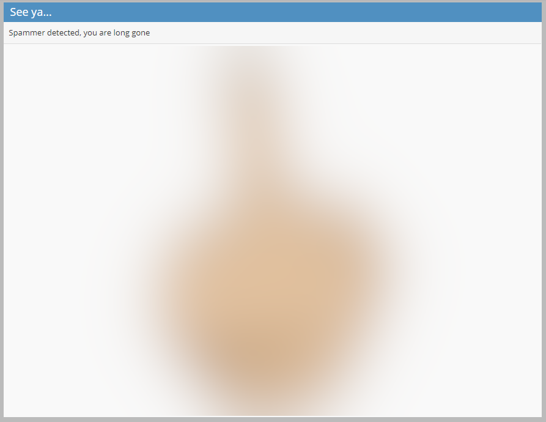

# SecurityExtend MantisBT Plugin

- [SecurityExtend MantisBT Plugin](#SecurityExtend-MantisBT-Plugin)
  - [Description](#Description)
  - [Installation](#Installation)
  - [Issues and Feature Requests](#Issues-and-Feature-Requests)
  - [Configuration](#Configuration)
    - [Configuration - General Security](#Configuration---General-Security)
  - [Usage](#Usage)
    - [Usage - Bug Blocker](#Usage---Bug-Blocker)
    - [Usage - Account Blocker](#Usage---Account-Blocker)
  - [Logging](#Logging)
  - [Screenshots](#Screenshots)
    - [Screenshots - Bug Block Configuration](#Screenshots---Bug-Block-Configuration)
    - [Screenshots - Log](#Screenshots---Log)
    - [Screenshots - The Bird Page](#Screenshots---The-Bird-Page)
  - [Todos](#Todos)

## Description

This plugin adds some additional spam security to MantisBT, including the following:

1. Block a bug from being created/updated if it contains a certain keyword or phrase
2. Block a bug from being created/updated if it contains a certain keyword or phrase, and `disable` the offending user account
3. Block a bug from being created/updated if it contains a certain keyword or phrase, and `delete` the offending user account

## Installation

Extract the release archive to the MantisBT installations plugins folder:

    cd /var/www/mantisbt/plugins
    wget -O SecurityExtend.zip https://github.com/mantisbt-plugins/SecurityExtend/releases/download/v1.0.0/SecurityExtend.zip
    unzip SecurityExtend.zip
    rm -f SecurityExtend.zip

Ensure to use the latest released version number in the download url:  (version badge available via the [ApiExtend Plugin](https://github.com/mantisbt-plugins/ApiExtend))

Install the plugin using the default installation procedure for a MantisBT plugin in `Manage -> Plugins`.

## Issues and Feature Requests

Issues and requests should be submitted on my [MantisBT](https://app1.spmeesseman.com/projects/set_project.php?project=SecurityExtend&make_default=no&ref=bug_report_page.php) site.

## Configuration

You can set access rights for viewing and/or editing the SecurityExtend options in the MantisBT plugin settings.  The default access rights are:

- View Access => MANAGER
- Edit Access => ADMINISTRATOR

The `Show bird on bug block` option will show a nice little goodbye image to a spammer for a few seconds before booting them to the login page, see the [screenshot](#Screenshots---The-Bird-Page) below.

Note that if you have the **Content-Security-Policy** header set within your config_inc.php **$g_custom_headers** config parameter, then you will need to add the https://img.shields.io/ url to the **img-src** section to be able to see badges in the Info page, for example:

    $g_custom_headers = array(
        "Content-Security-Policy: " .
        "frame-src http://gist-it.appshot.com/ 'self'; " .
        "img-src https://img.shields.io/ https://secure.gravatar.com/ 'self' data:; default-src 'self'; frame-ancestors 'self'; " .
        "font-src 'self'; " .
        "style-src 'self'; " .
        "script-src https://cdnjs.cloudflare.com/ http://gist-it.appspot.com/ 'self' 'unsafe-inline'"
    );

### Configuration - General Security

Some additional options that should be set in **config/config_inc.php** to help prevent spammers from posting content to your site:

1. Set the **$g_email_ensure_unique** parameter to `ON` (default is `ON`)
2. Set the **$g_tag_create_threshhold** parameter to an access level greater than that of **\$g_default_new_account_access_level**
3. Set the **$g_antispam_max_event_count** parameter to something lower than the default **10**, or adjust accordingly.
4. Set the **$g_antispam_time_window_in_seconds** to something lower than the default **3600**, or adjust accordingly.

## Usage

There are currently two components to the SecurityExtend plugin:

1. Bug Blocker
2. Account Blocker

### Usage - Bug Blocker

The `Bug Blocker` component will examine the following issue fields when a user creates or updates an issue/ticket/bug:

- summary
- description
- steps_to_reproduce
- additional_notes

If any text in either one of these fields contains a keyword or phrase that is set in the user defined list, appropriate action will be taken.  The keywords and phrases can be configured independently to provide the following actions when a bug blocking event is triggered:

- Block the issue create/update and display a spam warning
- Block the issue create/update and disable the offending user account
- Block the issue create/update and delete the offending user account

In cases 2 and 3, the user is also booted and sent back to the login page, no longer with an account to log in with.  Hopefully thet get frustrated and leave your site alone now.  A nice little goodbye image can be shown for a few seconds as well, see the  `Show bird on bug block` option in the [Configuration Section](#Configuration).

### Usage - Account Blocker

NOTE: As of August 2nd 2019, this feature is not yet complete.

The `Account Blocker` component will examine the email address of a user that is registering.  If the email address is from a domain that is set in the user defined list, the account will be blocked from being created.

Note that the MantisBT config setting allow_blank_email must be OFF for this component to operate (default is OFF):

    $g_allow_blank_email = OFF;

## Logging

All triggered events are logged and can be viewed in the `Log` tab, see the [screenshot](#Screenshots---Log) below.

## Screenshots

### Screenshots - Bug Block Configuration

### Screenshots - Log

### Screenshots - The Bird Page

Blurred here in the screenshot to remain considerate of readers.

## Todos

- [ ] Blacklist email domains from creating accounts
- [ ] Blacklist specific email addresses from creating accounts
- [x] Log events that have been triggered
